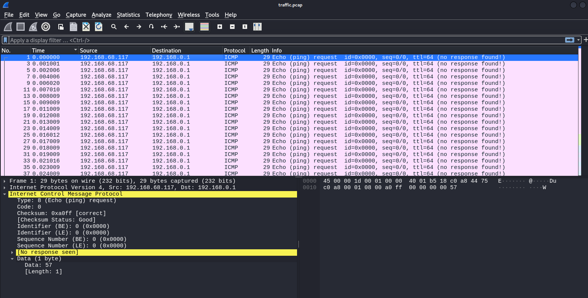
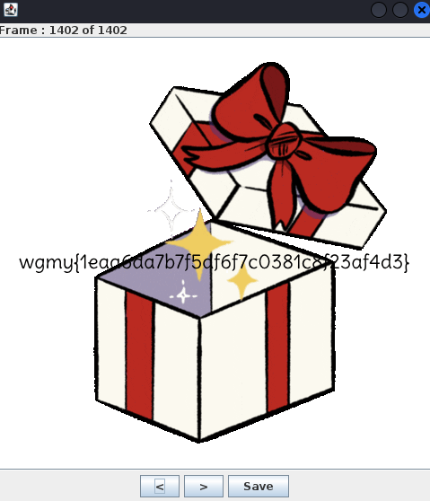
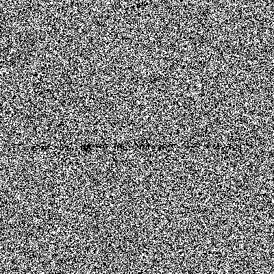
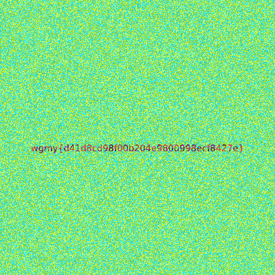

# 🚩 CTF Writeup: [Wargames.My 2024]
 
> **Date:** [28-29 DECEMBER 2024]  
> **Author:** [N3WBEES]  

---

# 📂 Table of Contents
1. [🔧 Reverse](#reverse)
   - [Stones](#rev-stones)
2. [🕵🏻‍♀️ Forensics](#forensics)
   - [Unwanted Meow](#forensics-unwanted-meow)
   - [I Can’t Manipulate People](#forensics-i-cant-manipulate-people)
3. [🧩 Miscellaneous](#miscellaneous)
   - [The DCM Meta](#misc-the-dcm-meta)
   - [Christmas GIFt](#misc-christmas-gift)
   - [Invisible Ink](#misc-invisible-ink)
4. [🔢 Cryptography](#cryptography)
   - [Rick's Algorithm](#ricks-algorithm)
   - [Credentials](#credentials)

---

## [Rev] Stones

## 📚 Overview

> *"When Thanos snapped his fingers, half of the flag was blipped. We need the Avengers to retrieve the other half. There's no flag in the movie, but there is a slash flag on the server (Please do not perform any brute forcing, enumeration, or scanning. Not useful nor needed)"*

> *"Author: KD_Kasturi"*

## ✨ Walkthrough

Given .EXE file written in Python and since Python is a *hybrid programming language*, we can retrieve back the original source code :D.

### 1. Converting Python .EXE into Python bytecode .PYC 

Utilise the tool [PyInstaller Extractor](https://github.com/extremecoders-re/pyinstxtractor) to convert the executable file into the bytecode. 

### 2. Converting Python bytecode .PYC into Python source code .PY

Use the online web tool [PyLingual](https://pylingual.io/) to retrieve the source code.

```python
# Decompiled with PyLingual (https://pylingual.io)
# Internal filename: CHAL-stones.py
# Bytecode version: 3.10.0rc2 (3439)
# Source timestamp: 1970-01-01 00:00:00 UTC (0)

import requests
from datetime import datetime
from urllib.request import urlopen
from datetime import datetime

server_url = 'http://3.142.133.106:8000/'
current_time = urlopen('http://just-the-time.appspot.com/')
current_time = current_time.read().strip()
current_time = current_time.decode('utf-8')
current_date = current_time.split(' ')[0]
local_date = datetime.now().strftime('%Y-%m-%d')

if current_date == local_date:
    print("We're gonna need a really big brain; bigger than his?")

first_flag = 'WGMY{1d2993'
user_date = current_date
params = {'first_flag': first_flag, 'date': user_date}
response = requests.get(server_url, params=params)

if response.status_code == 200:
    print(response.json()['flag'])
else:
    print(response.json()['error'])
```

Based on the *given hint* within the challenge description, it is stated that '*there is a slash flag on the server*' so what we could do is to use `curl http://3.142.133.106:8000/flag` in command prompt. After the curl, we will receive an output `{"Upload Date":"https://youtu.be/V0zJb2K4Yi8?si=xUTuXD3ppkJpU2Nw&t=75"}`.

Use the upload date of the video, which is `2022-07-25`, inside the script to obtain the flag from the server.

*Sorry for the short write-up lol, FYP hits me hard*.

## ⚙ Script

```python
import requests
from urllib.request import urlopen

server_url = 'http://<IP_ADDR>:8000/'
first_flag = 'WGMY{1d2993'
date = '2022-07-25'

params = {'first_flag': first_flag, 'date': date}
response = requests.get(server_url, params=params)

if response.status_code == 200:
    print(response.json()['flag'])
else:
    print(response.json()['error'])
```

## 🏳️ Flag

`WGMY{1d2993fc6327746830cd374debcb98f5}`

---

## [Forensics] Unwanted Meow

## 📚 Overview

> *"Uh.. Oh.. Help me, I just browsing funny cats memes, when I click download cute cat picture, the file that been download seems little bit wierd. I accidently run the file making my files shredded. Ughh now I hate cat meowing at me."*

> *"Author: 4jai"*

## ✨ Walkthrough

We were provided with a file that seemed to be a **corrupted JPEG**. Here’s how we approached the problem:

1. **Initial Analysis**:  
   We first opened the given file in a **hex editor** to determine its type. It appeared to be a JPEG file, but when saved in JPEG format, the picture was **corrupted**.

2. **Hex Analysis**:  
   Upon further inspection of the hex file, we noticed **numerous occurrences of the word "meow"**, which was causing the corruption.  
   To resolve this, we created a script that removed all instances of "meow" from the hex data.

   Here’s a look at the script we used to clean the file:
   ```bash
       # Hex representation of "meow"
    meow_hex = b'\x6D\x65\x6F\x77'

    with open(input_file, 'rb') as file:
        data = file.read()

    # Remove all occurrences of the hex sequence "meow"
    cleaned_data = data.replace(meow_hex, b'')

    # Ensure the file starts with the correct SOI marker (0xFF 0xD8)
    if not cleaned_data.startswith(b'\xFF\xD8'):
        print("The JPEG file does not start with the correct SOI marker.")
        return

    # Ensure the file ends with the correct EOI marker (0xFF 0xD9)
    if not cleaned_data.endswith(b'\xFF\xD9'):
        cleaned_data += b'\xFF\xD9'

    # Save the cleaned JPEG
    with open(output_file, 'wb') as file:
        file.write(cleaned_data)

    print(f"Repaired JPEG file saved as: {output_file}")

   # Example usage:
   remove_meow_from_jpeg('flag.jpg', 'fixed_flag.jpg')


3. **Fixing the File**:  
   The script needed to be run **twice** to ensure all instances of "meow" were removed.

4. **Final Result**:  
   After completing the process, we obtained the **correct image**, and from it, we extracted the flag.  
   

## 🏳️ Flag 
`wgmy{4a4be40c96ac6314e91d93f38043a634}`

---

### [Forensics] I Can't Manipulate People

## 📚 Overview

> *"Partial traffic packet captured from hacked machine, can you analyze the provided pcap file to extract the message from the packet perhaps by reading the packet data?"*

> *"Author: Ap0k4L1p5"*

## ✨ Walkthrough

We were given a **PCAP file** containing multiple ping echo packets. Here's how we solved it:

1. **Packet Analysis**:  
   After analyzing the PCAP file, we noticed numerous **ICMP ping echo packets**. By arranging the packets in the order they were captured, each packet’s data revealed a **flag character**.

   Here’s a snapshot of the packet data we found:
   

2. **Using tshark**:  
   To streamline the process, we used a tool called **tshark** to extract all the ICMP packet data. The data was in **hexadecimal** format, so we converted it to text to reconstruct the flag.

   ```bash
   tshark -r file.pcap -Y "icmp" -T fields -e icmp.type -e icmp.code -e data

## 🏳️ Flag 
`wgmy{1e3b71d57e466ab71b43c2641a4b34f4}`

---

### [Misc] The DCM Meta

## 📚 Overview

> *"[25, 10, 0, 3, 17, 19, 23, 27, 4, 13, 20, 8, 24, 21, 31, 15, 7, 29, 6, 1, 9, 30, 22, 5, 28, 18, 26, 11, 2, 14, 16, 12]"*

> *"Author: Yes"*

## ✨ Walkthrough

This challenge involved working with a **DCM file**. Here’s how we solved it:

1. **Hex Analysis**:  
   We opened the DCM file in a **hex editor** and quickly spotted the flag within. However, the flag was **out of order**.

2. **Reordering**:  
   We noticed that the flag’s characters had to be arranged according to the **index sequence** provided in the question. Using **0-based indexing**, we reordered the characters correctly:
   - Index 25 → 26th character: `'5'`
   - Index 10 → 11th character: `'1'`
   - Index 0 → 1st character: `'f'`

   By following this logic, we were able to arrange the flag correctly.

## 🏳️ Flag 
`wgmy{51fadeb6cc77504db336850d53623177}`

---

### [Misc] Christmas GIFt

## 📚 Overview

> *"Here is your christmas GIFt from santa! Just open and wait for it.."*

> *"Author: SKR"*

## ✨ Walkthrough

This challenge involved analyzing a **GIF file** to extract the hidden flag. Here's how we solved it:

1. **Using stegsolve**:  
   We used **stegsolve** to analyze the GIF file's frames. There were **numerous frames** in the GIF, and we suspected the flag was hidden in the final frame.

   Here’s a look at the GIF frames:

   

3. **Locating the Flag**:  
   After navigating to the **last frame**, we found the hidden flag.  

   

## 🏳️ Flag
`wgmy{1eaa6da7b7f5df6f7c0381c8f23af4d3}`

---

### [Misc:] Invisible Ink

## 📚 Overview

> *"The flag is hidden somewhere in this GIF. You can't see it? Must be written in transparent ink."*

> *"Author: Yes"*

## ✨ Walkthrough

In this challenge, we were asked to find hidden information within a GIF. Here's how we approached the solution:

1. **Analyzing Frames**:  
   We started by using **stegsolve** to analyze the frames of the GIF. Two frames appeared to contain partial flags:
   - **Frame 1**: Partial flag
   - **Frame 2**: Additional partial flag  

   Here's a look at the frames:
   
   
   
   

3. **Revealing the Flag**:  
   By applying the **random color map function** in stegsolve, portions of the flag were revealed in each frame.

4. **Combining the Frames**:  
   Finally, we used the **image combiner** feature in stegsolve to merge the two frames, revealing the complete flag.

   

## 🏳️ Flag
`wgmy{d41d8cd98f00b204e9800998ecf8427e}`

---


