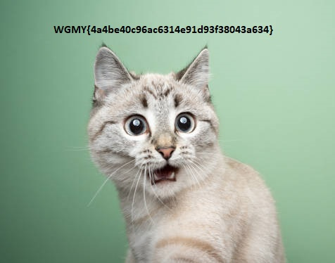

# 🚩 CTF Writeup: [Wargames.My 2024]
 
> **Date:** [28-29]  
> **Author:** [N3WBEES]  

---

## 📂 Table of Contents
1. [Reverse](#reverse)
   - [Stones](#stones)
2. [Forensics](#forensics)
   - [Unwanted Meow](#unwanted-meow)
   - [I Can’t Manipulate People](#i-cant-manipulate-people)
3. [Cryptography](#cryptography)
   - [Rick's Algorithm](#ricks-algorithm)
   - [Credentials](#credentials)
4. [Miscellaneous](#miscellaneous)
   - [The DCM Meta](#the-dcm-meta)
   - [Christmas GIFt](#christmas-gift)
   - [Invisible Ink](#invisible-ink)

---

## 🔍 Reverse
### Stones
**Challenge Description:**  
[Add the description or summarize it here.]

**Solution:**  
1. **Step 1:** [Explain the first step.]  
   Example command:
   ```bash
   strings stones_binary

**Flag:**

---

# Forensics: Unwanted Meow

### Solution:

We were provided with a file that seemed to be a **corrupted JPEG**. Here’s how we approached the problem:

1. **Initial Analysis**:  
   We first opened the given file in a **hex editor** to determine its type. It appeared to be a JPEG file, but when saved in JPEG format, the picture was **corrupted**.  
   

2. **Hex Analysis**:  
   Upon further inspection of the hex file, we noticed **numerous occurrences of the word "meow"**, which was causing the corruption.  
   To resolve this, we created a script that removed all instances of "meow" from the hex data.

   Here’s a look at the script we used to clean the file:
   

3. **Fixing the File**:  
   The script needed to be run **twice** to ensure all instances of "meow" were removed.

4. **Final Result**:  
   After completing the process, we obtained the **correct image**, and from it, we extracted the flag.  
   

**Flag**: `wgmy{4a4be40c96ac6314e91d93f38043a634}`

---

# Forensics: I Can't Manipulate People

### Solution:

We were given a **PCAP file** containing multiple ping echo packets. Here's how we solved it:

1. **Packet Analysis**:  
   After analyzing the PCAP file, we noticed numerous **ICMP ping echo packets**. By arranging the packets in the order they were captured, each packet’s data revealed a **flag character**.

   Here’s a snapshot of the packet data we found:
   

2. **Using tshark**:  
   To streamline the process, we used a tool called **tshark** to extract all the ICMP packet data. The data was in **hexadecimal** format, so we converted it to text to reconstruct the flag.

**Flag**: `wgmy{1e3b71d57e466ab71b43c2641a4b34f4}`

---

# Misc: The DCM Meta

### Solution:

This challenge involved working with a **DCM file**. Here’s how we solved it:

1. **Hex Analysis**:  
   We opened the DCM file in a **hex editor** and quickly spotted the flag within. However, the flag was **out of order**.

   At first, the arrangement seemed incorrect:
   

2. **Reordering**:  
   We noticed that the flag’s characters had to be arranged according to the **index sequence** provided in the question. Using **0-based indexing**, we reordered the characters correctly:
   - Index 25 → 26th character: `'5'`
   - Index 10 → 11th character: `'1'`
   - Index 0 → 1st character: `'f'`

   By following this logic, we were able to arrange the flag correctly.

**Flag**: `wgmy{51fadeb6cc77504db336850d53623177}`

---

# Misc: Christmas GIFt

### Solution:

This challenge involved analyzing a **GIF file** to extract the hidden flag. Here's how we solved it:

1. **Using stegsolve**:  
   We used **stegsolve** to analyze the GIF file's frames. There were **numerous frames** in the GIF, and we suspected the flag was hidden in the final frame.

   Here’s a look at the GIF frames:
   

2. **Locating the Flag**:  
   After navigating to the **last frame**, we found the hidden flag.  
   

**Flag**: `wgmy{1eaa6da7b7f5df6f7c0381c8f23af4d3}`

---

# Misc: Invisible Ink

### Solution:

In this challenge, we were asked to find hidden information within a GIF. Here's how we approached the solution:

1. **Analyzing Frames**:  
   We started by using **stegsolve** to analyze the frames of the GIF. Two frames appeared to contain partial flags:
   - **Frame 1**: Partial flag
   - **Frame 2**: Additional partial flag  

   Here's a look at the frames:
   
   

2. **Revealing the Flag**:  
   By applying the **random color map function** in stegsolve, portions of the flag were revealed in each frame.

3. **Combining the Frames**:  
   Finally, we used the **image combiner** feature in stegsolve to merge the two frames, revealing the complete flag.

   

**Flag**: `wgmy{d41d8cd98f00b204e9800998ecf8427e}`

---


